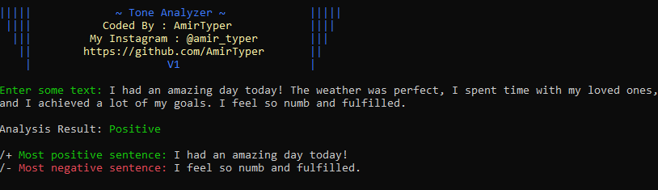
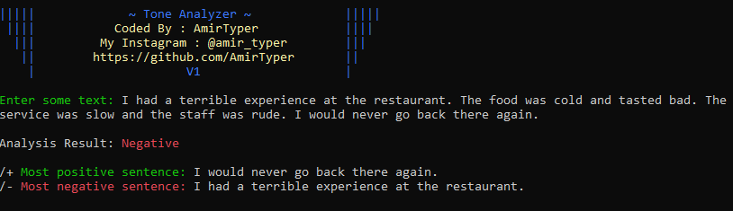
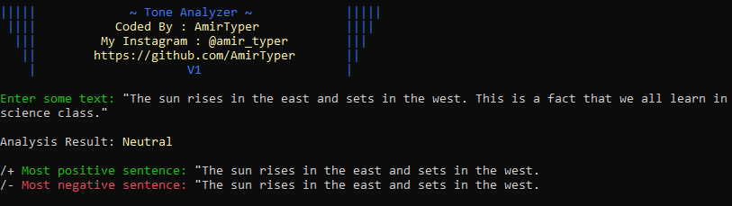

# Sentiment-Analysis-Tool
An easy-to-use Sentiment Analysis tool in Python using TextBlob library that analyzes the polarity of input text and returns the overall sentiment as well as the most positive and negative sentence. Perfect for sentiment analysis in natural language processing and machine learning projects. #Python #SentimentAnalysis #TextBlob #NLP #MachineLearning

 

 

# Dependencies
* textblob
* textblob.exceptions
* os

# Notes

* The code uses TextBlob library to determine the sentiment polarity of the input text.

* It asks the user to input some text, and then determines whether the sentiment is positive, negative, or neutral based on the polarity score.

* It also identifies the most positive and most negative sentence in the input text.
* Feel free to use this code in your projects.
* Enjoy! and let me know what would you like to see in the future version of this project.

# Usage
<pre><code>git clone https://github.com/AmirTyper/Sentiment-Analysis-Tool
cd Sentiment-Analysis-Tool
pip install -r requirements.txt
python -m textblob.download_corpora
python sentiment_analysis.py
</code></pre>

# Support me
The easiest way to support me is to click on the star (<g-emoji class="g-emoji" alias="star" fallback-src="https://github.githubassets.com/images/icons/emoji/unicode/2b50.png">⭐</g-emoji>) at the top of the <a href="https://github.com/AmirTyper/Sentiment-Analysis-Tool">GitHub page</a>.

# Contact me
<pre><code>Developer's Telegram: <a href="https://t.me/Mr_Amir_Typer">click</a>
Developer's Instagram: <a href="https://instagram.com/amir_typer">click</a>
Developer's Twitter: <a href="https://twitter.com/AmirTyper">click</a>
My Website: <a href="https://amirtyper.ir">amirtyper.ir</a>
</code></pre>
